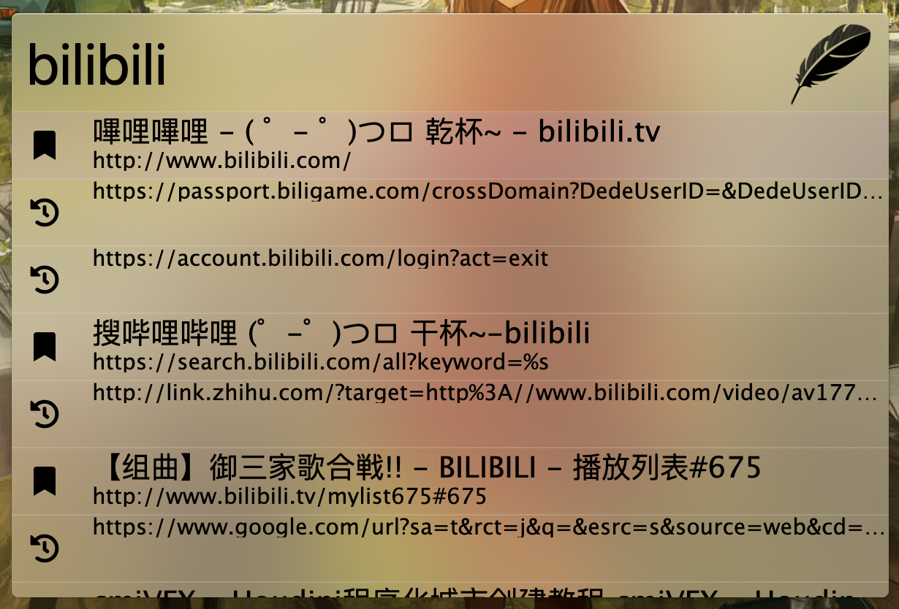

# Zazu Firefox Bookmarks

Firefox bookmark and history searcher for [Zazu](https://github.com/tinytacoteam/zazu).

## Usage

Type for example `f youtube` then Zazu will list what you bookmarked in YouTube web site, and what you visited in this web site.

By setting a variable `"prefix": false,` in the `~/.zazurc.json` you can search without prefix:



You can search browser history likes `zazu` which is fast and returns precise result, or `zazu issue error` for fuzzy search result with `zazu` and `issue` and `error`, though it might be slow since history database is huge.

Bookmark search is fuzzy by default, since bookmark database is small enough.

## Installing

Add the package to your plugins array in `./zazurc.js`.

```javascript
{
  "plugins": [
    "linonetwo/zazu-firefox-bookmarks"
  ]
}
```

## Variables

```javascript
{
  "name": "linonetwo/zazu-firefox-bookmarks",
  "variables": {
    "profileVersion": "123 Normally you don't need this",
    "prefix": false,
    "limit": 5
  }
}
```

### `prefix`

When set to false, you don't need `f` prefix to trigger bookmark and history search.

### `limit`

Maximum number of returned items, by default is 15.

### `profileVersion`

Fill in `profileVersion` if your profile version is not `default`. Normally you don't need to use this variable.

## Disclaimer

Boilerplate is from [tinytacoteam/zazu-chrome-bookmarks](https://github.com/tinytacoteam/zazu-chrome-bookmarks).

I've use the source code from [CCharlieLi/bookmark-parser](https://github.com/CCharlieLi/bookmark-parser) which is not actively maintained, but instead use unstable C++ code (node-gyp sometimes failed), I use [jusw85/mozlz4 writen in rust](https://github.com/jusw85/mozlz4) binary to handle the dirty job.
